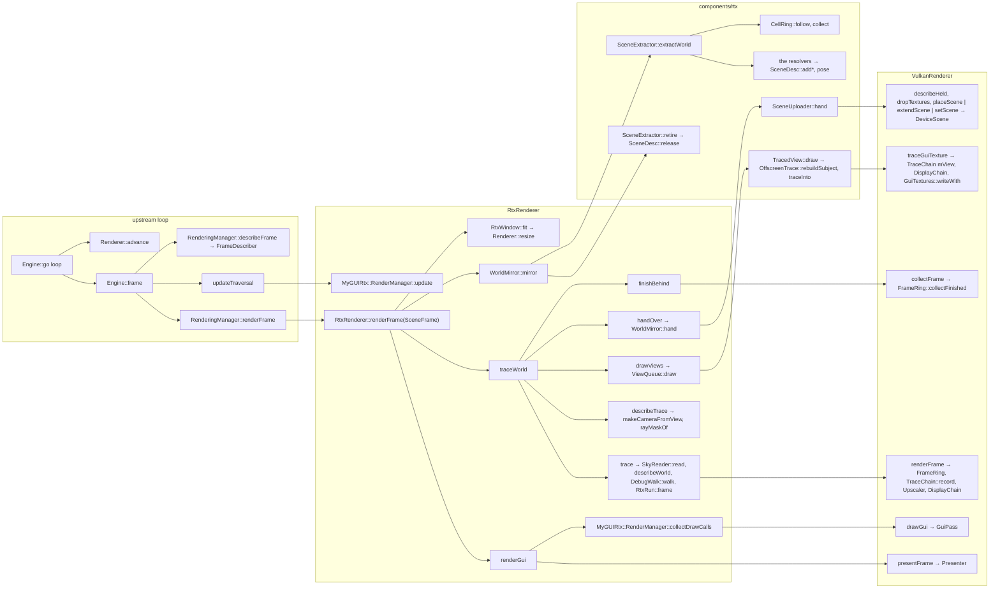

# The ray tracing renderer

How the ray tracing renderer is integrated into OpenMW, what it is made of, who owns whom, who
calls whom, and in what order a frame is computed. Read this once before you open the tree.
Each section names the files that hold the detail. The headers in those files carry the
reasoning behind each decision, so this document states what is and points at why.

The tree's own words (walk, mirror, hand over, stand, sweep, slot, run, hold, epoch, ring) are
listed beside the field's words in [`components/rtx/GLOSSARY.md`](../../components/rtx/GLOSSARY.md).

1. [What the fork is](#1-what-the-fork-is)
2. [Layers and libraries](#2-layers-and-libraries)
3. [The build](#3-the-build)
4. [The seam: `MWRender::Renderer`](#4-the-seam-mwrenderrenderer)
5. [The game-side owner](#5-the-game-side-owner)
6. [The interface](#6-the-interface)
7. [The core](#7-the-core)
8. [The backend](#8-the-backend)
9. [Ownership graph](#9-ownership-graph)
10. [Call graph](#10-call-graph)
11. [Computation sequences](#11-computation-sequences)
12. [Threads](#12-threads)
13. [Contracts the code asserts](#13-contracts-the-code-asserts)
14. [Harness, instruments, tests](#14-harness-instruments-tests)
15. [File index](#15-file-index)

---

## 1. What the fork is

Upstream OpenMW 0.52 stays the host engine: cells, references, physics, scripts, animation,
weather and GUI logic. It no longer owns the picture. A second renderer stands beside the
OpenGL rasterizer and replaces the whole image: primary visibility, shadows, direct and
indirect light, sky, water and fog are ray traced on the GPU. The rasterizer is not modified.
Both renderers stand behind one interface. One binary ships both, and the one not chosen never
starts.

The target is NVIDIA RTX, Turing and later, through Vulkan 1.4 with ray tracing pipelines, ray
queries, position fetch and shader invocation reorder. DLSS Ray Reconstruction is the default
denoiser and upscaler. Vanilla content is read as it is. The textures are pre-lit, so the
renderer estimates the painted light and divides it out.

The renderer is chosen by `[RTX] enabled`. A build with `-DOPENMW_RTX=OFF` leaves it out.
The player-facing settings are in
[`docs/source/reference/modding/settings/rtx.rst`](../source/reference/modding/settings/rtx.rst).

---

## 2. Layers and libraries

Each layer knows the layer below it and never the one above.

```
apps/openmw                      the game: cells, references, physics, scripts, weather, GUI
  │
  │  MWRender::Renderer          THE SEAM  (apps/openmw/mwrender/renderer.hpp)
  ├── GlRenderer                 upstream's rasterizer, gathered   (mwrender/gl*.cpp)
  └── RtxRenderer                the game-side owner               (mwrender/rtx/)
        │
        │  Rtx::Renderer         the core's interface  (components/rtx/renderer.hpp)
        │  Rtx::SceneDesc        what the scene is     (components/rtx/scenedesc.hpp)
        │
        ├── components/rtx       THE CORE: the scene description, the mirror of the scene graph,
        │                        the cell streaming, the sky, the sea, the material recovery.
        │                        No graphics API. No game headers.
        └── components/rtxvulkan THE BACKEND: VulkanRenderer. What is true of the API lives here.
                                   └── NGX (DLSS Ray Reconstruction), with OPENMW_RTX_DLSS

Beside the stack:
  components/myguirtx            MyGUI's backend over Rtx::GuiRenderer
  components/rtxbench            the instruments a measured run is taken with; knows no world
  apps/rtxtool                   the harness: openmw-rtxtool drives a real game headless
```

A fact about Vulkan that reaches `components/rtx` or `apps/openmw` is a bug. The linker keeps
it so: `openmw-rtx` has no Vulkan header on its include path, and `openmw-rtx-vulkan` links
Vulkan as `PRIVATE`. The two places that create a backend call `Rtx::createVulkanRenderer`:
`RtxRenderer`'s constructor and the harness. OpenSceneGraph is not that boundary: the scene
arrives as an `osg::Node` graph, and the core reads one.

---

## 3. The build

| option            | default | meaning                                                          |
|-------------------|---------|------------------------------------------------------------------|
| `OPENMW_RTX`      | ON      | build the renderer, its libraries, its tests and the harness      |
| `OPENMW_RTX_DLSS` | ON      | link NGX for DLSS Ray Reconstruction; needs `NGX_ROOT`, version exact |

`OPENMW_RTX` includes `components/rtx/build.cmake`, which sets the fork's compile flags
(warnings are errors), the resource root, and adds the subdirectories. `components` gets a
public `OPENMW_RTX` definition, read by `#ifdef OPENMW_RTX` in `mwrender/renderer.cpp`.

| target                      | directory              | links                                                        |
|-----------------------------|------------------------|--------------------------------------------------------------|
| `openmw-rtx`                | `components/rtx`       | `components`                                                  |
| `openmw-rtx-vulkan`         | `components/rtxvulkan` | `openmw-rtx`; Vulkan, SDL2, VMA, NGX as `PRIVATE`             |
| `openmw-rtx-bench`          | `components/rtxbench`  | `openmw-rtx`                                                  |
| `openmw-rtx-mygui`          | `components/myguirtx`  | `openmw-rtx`, `components`                                    |
| `openmw-rtxtool-lib`        | `apps/rtxtool`         | the three component libraries, `components`, Boost, SDL2      |
| `openmw-rtxtool`            | `apps/rtxtool`         | `openmw-rtxtool-lib`, `openmw-lib`                            |
| `openmw-rtx-vulkan-shaders` | `components/rtxvulkan` | every `.spv` under `resources/rtx/shaders/`                   |

`openmw-lib` links the four component libraries and compiles `mwrender/rtx/*.cpp` with the
seam files. Shaders are compiled by `glslc` for Vulkan 1.4 and validated by `spirv-val` in one
command, so an invalid module fails the build. The C++/GLSL shared headers are
`components/rtx/shaders/*.h`. Validation layers are on outside a Release build
(`Rtx::sValidationByDefault`); `OPENMW_RTX_SYNC_VALIDATION` and `OPENMW_RTX_GPU_VALIDATION`
raise the level at run time.

`CMakePresets.json` names the flavours `debug`, `release`, `asan` and `nodlss`, per system.
`apps/rtxtool/rtx <flavour> <build|test|game|repeat|gate|verb>` is the one command line over
them.

---

## 4. The seam: `MWRender::Renderer`

File: `apps/openmw/mwrender/renderer.hpp`. The one interface the game talks to. Read its
header first.

Rules:

- A pure virtual is a question both renderers answer. A default body is an empty answer one
  renderer has no work for.
- Nothing below the seam is abstracted. Contexts, swapchains, render bins and acceleration
  structures belong to a renderer outright.
- The game is never handed one renderer's mechanism. Two exceptions remain for upstream
  callers that cannot change: `getPostProcessor()` and `getCompileOperation()`, null under
  the ray tracer.
- `createRenderer("opengl" | "raytrace", spec)` throws for a name the build lacks. No fallback.
- The base keeps what both share: the resource system, the frame clock, the screenshot writer,
  the adopted `osg::Camera`, `FrameStamp` and `Stats`, the traversal root, the view mask, and
  the two "is the world shown" answers (`showWorld`, `toggleRenderMode(Render_Scene)`).

### 4.1 The seam's types

| type                                            | file                  | role                                                                 |
|-------------------------------------------------|-----------------------|----------------------------------------------------------------------|
| `RendererSpec`                                  | `renderer.hpp`        | the resource directory and the cache directory                        |
| `WindowPlacement`, `describeWindow`, `applyWindowHints` | `renderer.hpp` | what every renderer asks SDL for                                    |
| `SceneFrame`                                    | `sceneframe.hpp`      | what there is to draw: the scene root, the stamp, `SkyState`, `Precipitation`, `WorldState`, `EyeState`, `Terrain::World`, `ObjectStorage`, the delta time, paused |
| `WorldState`, `EyeState`, `WaterState`, `FogBand` | `sceneframe.hpp`    | the game's facts in the content's own numbers, undecoded              |
| `SkyState`, `Precipitation`                     | `skystate.hpp`, `precipitation.hpp` | what the weather settled and what it drops              |
| `FrameDescriber`, `FrameSources`                | `framedescriber.hpp`  | where the fork's per-frame facts are collected, so `renderingmanager.cpp` stays upstream's |
| `Ground`, `GroundSpec`                          | `ground.hpp`          | one worldspace's ground and distance                                  |
| `OffscreenView`, `SubjectView`, `OffscreenViewSpec` | `offscreenview.hpp` | a picture taken somewhere other than the eye, for the GUI            |
| `MapOverlay`, `MapOverlaySpec`                  | `mapoverlay.hpp`      | the explored cells painted over the world map                         |

Where the eye stands is not in the frame. The update traversal writes the view matrix onto the
adopted camera after the frame is described, and a renderer reads it at the moment it draws.

### 4.2 Who calls the seam

| caller                             | calls                                                                                              |
|------------------------------------|----------------------------------------------------------------------------------------------------|
| `OMW::Engine::go`                  | `createRenderer` or `EngineHost::createRenderer`, `setFrameClock`, `setFrameRateLimit`; `awaitFrame` then `advance` per loop |
| `OMW::Engine::prepareEngine`       | `setTraversalRoot`, `prepareResources`, `setScreenshotWriter`, `getWindow`                          |
| `OMW::Engine::frame`               | `getStartTick`, `getStats`, `eventTraversal`, `updateTraversal`                                     |
| `RenderingManager` ctor and dtor   | `createSceneRoot`, `attachWorld`, `getCamera`, `getCompileOperation`, `detachWorld`                 |
| `RenderingManager` per frame       | `describeFrame(frame)` between the traversals, `renderFrame(frame)` after the update                |
| `RenderingManager` on events       | `addCell`, `removeCell`, `add/removeWaterRippleEmitter`, `emitWaterRipple`, `notifyCut`, `toggleRenderMode`, `capture`, `processChangedSettings`, `createGround`, `listAssetsToPreload`, `suspendDraw`, `resumeDraw` |
| `MWGui::WindowManager`             | `createGuiPlatform`, `getWindow`, `showWorld`, `setViewMask`, `renderGuiFrame`, `setVSync`, `getPostProcessor` |
| `MWGui::LoadingScreen`             | `beginLoading`, `endLoading`, `freezeFrame`, `renderLoadingFrame`                                   |
| `LocalMap`, `CharacterPreview`, `GlobalMap` | `createWorldView`, `getGroundReach`; `createSubjectView`; `createMapOverlay`               |
| `MWLua`                            | `reloadShaders`, `setLiveShaderReload`, `forgetScriptState`                                          |
| `MWInput::InputManager`            | the `SDLUtil::GraphicsListener` events: window size, function keys                                  |

### 4.3 The two implementations

| question            | `GlRenderer`                                   | `RtxRenderer`                                                   |
|---------------------|------------------------------------------------|-----------------------------------------------------------------|
| window              | SDL with a GL context, through `osgViewer`      | SDL with `SDL_WINDOW_VULKAN`; no GL context ever, asserted       |
| camera, stamp, stats| the viewer's                                    | made in the constructor and adopted                              |
| scene root          | `SceneUtil::LightManager`                       | a plain `osg::Group`; lights are gathered on the walk            |
| model shaders       | the scene manager's shader visitor              | off; state is read as the loader left it                         |
| ground              | `GlGround`: quad tree, paging, groundcover      | `TracedGround`: no chunks, plus the cell ring                    |
| a frame             | `viewer->frame()`: cull and draw                | walk and sweep, hand over, views, trace, GUI, present            |
| offscreen pictures  | `GlOffscreenView`: RTT cameras                  | `TracedView` over `Rtx::OffscreenTrace`                          |
| map overlay         | `GlMapOverlay`: a camera blit                   | `TracedOverlay`: composited in main memory                       |
| GUI                 | MyGUI's OSG platform, hung in the graph         | `MyGUIRtx::RenderManager`, called by the frame directly          |
| post processing     | `PostProcessor`                                 | none                                                            |
| sky, water          | `SkyManager`, `Water`, `RippleSimulation`       | `SkyReader` describes; the trace draws; `RippleEmitters` feed `RipplePass` |

The rasterizer's files (`glrenderer`, `glworld`, `glground`, `gloffscreenview`,
`glmapoverlay`) are upstream's code gathered behind the seam, not rewritten.

---

## 5. The game-side owner

Directory: `apps/openmw/mwrender/rtx/`. `RtxRenderer` is the ray tracer as the game sees it: a
window, a mirror of the scene graph, a trace, and the interface over it. It drives the frame
itself. There is no viewer, no cull and no draw traversal, because rays go everywhere.

| entity            | file                | what it is                                                                                   |
|-------------------|---------------------|----------------------------------------------------------------------------------------------|
| `RtxRenderer`     | `rtxrenderer.hpp`   | the owner; every seam answer; the phase state machine                                         |
| `RtxWindow`       | `rtxwindow.hpp`     | the SDL window, fitted once its size settles for 0.1 s, titled with the frame rate            |
| `WorldMirror`     | `worldmirror.hpp`   | the walk, the sea, the ring, the hand-over, the sweep                                         |
| `SkyReader`       | `skyreader.hpp`     | `SkyState` and `WorldState` into an `Rtx::WorldReading`; holds the sky's sheets in the scene   |
| `RippleEmitters`  | `rippleemitters.hpp`| who disturbs the water this frame, by the rasterizer's own rule                               |
| `DebugWalk`       | `debugwalk.hpp`     | the debug modes' geometry under `Mask_Debug` into flat line lists                             |
| `ViewQueue`       | `viewqueue.hpp`     | the pictures inside the interface and the map's overlay, and the views asked for since the last frame |
| `TracedView`      | `tracedview.hpp`    | `OffscreenView` and `SubjectView` as the ray tracer makes them                                |
| `TracedGround`, `TracedTerrain` | `tracedground.hpp`, `tracedterrain.hpp` | a `Terrain::World` with no chunks, and the ring; a height grid per cell for the intersector only |
| `TracedOverlay`   | `tracedoverlay.hpp` | the world map overlay, composited in main memory                                              |
| `FrameTimer`, `FrameReport`, `FrameContext` | `frametimer.hpp`, `framereport.hpp` | where a frame enters and leaves; what one frame came to |
| `RtxRun`, `PlayedRun`, `RtxSetup` | `rtxrun.hpp` | the run a host drives through the renderer                                         |
| `sClassMasks`, `rayMaskOf` | `classmasks.hpp` | the one mapping between node masks and instance classes                                |

**Two hosts, one renderer.** A played session and a harness run reach the renderer through
one record, `RtxSetup`: an `Rtx::RunSetup` (profile, validation, `MirrorKnobs`, headless, a
stated step or the wall, settled adoption) and the `RtxRun` the host implements. A played
session installs none, and `RtxRenderer` makes a `PlayedRun` whose every answer is the played
one. `RtxRun` answers per frame: which sample to take, how many frames are summed, whether to
walk twice, whether to keep the picture, and it receives every `FrameReport`; once a second it
says what the window's title carries after the rate, which the harness answers with the
weather, the one crossing in while one is, and the hour, and a played session with nothing.
`RtxSettingValues::fromRegistry` (`rtxsettings.hpp`) is where the ray tracer's own settings are
read, and `RtxSettings::derive` is what they mean — the one derivation, which the harness fills
from its command line as well. The renderer reads the engine's own besides: the vertical sync and
groundcover where it is made, `reflex flash` at each frame's click, and `Settings::models()` for
the sky's meshes (`SkyReader`). The core reads no settings.

**The phase state machine.** `RtxRenderer::Phase` is asserted at every entry point through
`Rtx::Stepped`:

```
Between ──► Walking ──► Placing ──► Views ──► Tracing ──► Run ──► Gui ──► Between
   ▲            │                                                   ▲
   │            └───── world hidden: straight to Gui ───────────────┘
   └── the engine's own calls (addCell, attachWorld, notifyCut, ...) land here
```

**Class masks.** `rayMaskOf(cullMask)` turns a camera's cull mask into the `MASK_*` bits its
rays meet. `Static` is `Mask_Object | Mask_Static | Mask_Terrain | Mask_Groundcover`, `Actor`
is `Mask_Actor | Mask_Player`, `Effect` is `Mask_Effect`, `FirstPerson` is `Mask_FirstPerson`.
Water and particle masks become `MASK_WATER` and `MASK_PARTICLE`. The world walk excludes
`Mask_Sky`, `Mask_Sun`, `Mask_SimpleWater` and `Mask_Terrain`, which the ray tracer draws
itself.

---

## 6. The interface

MyGUI draws the whole interface, as upstream. What changes is what MyGUI draws with. Nothing
of the interface hangs in the scene graph under the ray tracer: the renderer's own frame calls
the GUI backend, once to animate and once to draw.

### 6.1 The seam into MyGUI

File: `components/myguiplatform/guirendermanager.hpp`. `MyGUIPlatform::GuiRenderManager` is
MyGUI's own `RenderManager` plus the calls every backend needs and MyGUI does not declare:
`initialise`, `shutdown`, `registerFactories`, and two `shareTexture` overloads. Upstream's
`Platform` takes a `unique_ptr<GuiRenderManager>` and calls the hooks. Upstream's OSG render
manager implements the same interface, so `WindowManager` never asks which backend it got.

`shareTexture` is the one route from a picture in main memory to the interface. The fog of
war, the world map, a save's thumbnail, a video frame and the frozen loading frame are
`osg::Image`s the game writes and marks dirty. The rasterizer draws the texture as it stands.
The ray tracer mirrors the image and re-reads it when its modified count moves. A caller writes
the image as it always did.

`Renderer::createGuiPlatform(scale, path, log)` is where a renderer makes its backend.
`WindowManager`'s constructor computes the scale (`[GUI] scaling factor` times the pixel to
point ratio of the window), calls it, initialises `MyGUI::Gui`, then calls
`registerFactories`. `WindowManager::windowResized` calls `setViewSize`.

### 6.2 `MyGUIRtx::RenderManager`

File: `components/myguirtx/rendermanager.hpp`. Written once for every backend: MyGUI's
interface is mostly bookkeeping no API has an opinion about, and what is left is a table of
textures and one call that draws a list of triangles. Those are what `Rtx::GuiRenderer`
(`components/rtx/guirenderer.hpp`) offers, and the render manager consumes nothing else of
the renderer.

| call                        | from                              | what it does                                                                 |
|-----------------------------|-----------------------------------|------------------------------------------------------------------------------|
| `update(step)`              | `RtxRenderer::updateTraversal`    | one frame of widget animation, by the frame clock's step and not MyGUI's wall timer, so two runs of one build fade an overlay alike |
| `collectDrawCalls()`        | `RtxRenderer::renderGui`          | `begin` clears the two vectors; `onRenderToTarget` makes every layer call `doRender`; then one `GuiRenderer::drawGui(vertices, batches)` |
| `doRender(buffer, texture, count)` | MyGUI's layers             | `refresh()` the texture, copy the vertices into one vector, push one `GuiBatch` (slot, first vertex, count, blend) |
| `setViewSize(w, h)`         | `WindowManager::windowResized`    | the view size in GUI points, `onResizeView`, a relayout                       |
| `createTexture(name)`       | MyGUI, fonts, skins               | a `Texture` under a name                                                     |
| `takeTexture(name)`         | `TracedView`                      | a `Texture` the caller owns as a `TextureHandle`; MyGUI still finds it by name |
| `shareTexture(...)`         | the game, through the platform    | a `SharedTexture` or a `PaintedMirror`                                       |
| `setAdditiveBlend(on)`      | `AdditiveLayer`                   | every batch gathered from here on is marked additive                          |

`VertexBuffer` is a `std::vector<MyGUI::Vertex>` and nothing more. There is no double
buffering: the frame is gathered, copied and submitted inside `collectDrawCalls`, so there is
never a second reader. `MyGUI::Vertex` and `Rtx::GuiVertex` are asserted the same twenty-four
bytes, so the renderer reads MyGUI's vertices as its own. `AdditiveLayer` is upstream's layer
for the hit flash, registered under the same type name, so layouts do not change.

### 6.3 The texture kinds

Every GUI texture is a `SlotTexture`: a `Rtx::GuiSlot` in the renderer's table, a size and a
name. `refresh()` is called once per draw from `doRender`, and is where a mirror finds what the
game wrote.

| kind             | made by                                  | used for                                                          | how the pixels get in                                              |
|------------------|------------------------------------------|-------------------------------------------------------------------|--------------------------------------------------------------------|
| `Texture`        | `createTexture`, `takeTexture`           | fonts, skins, the 8 × 8 helper textures, and every traced picture   | MyGUI's `lock` and `unlock`, which are `lendGuiTexture` and `sendGuiTexture`. The buffer lent is the renderer's own staging memory, write-combined: write it, never read it. Fewer than four channels are widened on the way out. `loadFromFile` reads through the image manager |
| `SharedTexture`  | `shareTexture(osg::Texture2D&)`           | video frames, the global map's base, a save's thumbnail, the frozen loading frame | `refresh` compares the image's modified count, then its rows against a kept copy, and sends the run of rows that differ. A new image under the texture goes whole |
| `PaintedMirror`  | `shareTexture(SceneUtil::PaintedTexture&)` | the fog of war, the world map overlay                             | the painter names the rectangle; `refresh` sends that rectangle and nothing else |

`MirrorTexture` is the base of the two mirrors: `createManual`, `lock` and `loadFromFile`
throw, because the picture is the game's. `rgbarows.hpp` turns any OSG image format into
four bytes a pixel. `getRenderTarget` is null in both backends: nothing renders a widget tree
to a texture.

### 6.4 The backend's half

`Rtx::GuiRenderer` is the part of `Rtx::Renderer` the interface consumes: `getExtents`,
`addGuiTexture`, `lendGuiTexture`, `sendGuiTexture`, `dropGuiTexture`, `drawGui`,
`traceGuiTexture`, `takeGuiCopy`, `finishGuiTraces`.

`GuiTextures` (`components/rtxvulkan/guitextures.hpp`) is the table. A slot is taken from a
`SlotPool`, so a freed slot is reused before the table grows. A texture rests in
`SHADER_READ_ONLY_OPTIMAL` between calls. Making and writing a texture are recorded into a
batch handed to the command pool, to go ahead of whatever submits next: ordered before every
reader and never waited for, except `finish` at a resize and at shutdown. There are
`sFrameSlots + 1` staging arenas. An arena a frame overflows is buried and replaced by one as
large as that frame's writes so far, so each grows to the most one frame wrote into it, and a
frame that writes as much again, a video's every frame, allocates nothing. `writeWith` lends a texture to device commands (a
traced picture); `readBackWith` and `takeCopy` carry a copy back to the host on the same
submit as the trace that wrote it.

`VulkanRenderer::drawGui(vertices, batches)` runs on the interface's own ring, counted by
`mGuiFrame`, because a menu is drawn on frames with no world:

1. Take the slot of `mGuiFrame`, and wait for the vertex buffer the interface drew from two
   frames ago.
2. `GuiTextures::startFrame`: take the staging that frame's fence freed.
3. Write the vertices into the slot's host-visible buffer. No staging copy.
4. Resolve every batch to an image view and a blend.
5. On the slot's own command buffer: the target to colour attachment, `GuiPass::record`, the
   target back to general. Submit, not waited for.

`GuiPass` (`guipass.hpp`, `gui.vert`, `gui.frag`) draws the interface's triangles, the only
triangles in the backend beside the debug lines. Two pipelines, over and additive, bound again
only where the blend changes. It runs after the tone curve, because MyGUI's colours are
display-referred. The present's blit is queued after the frame's submit and the GUI's; the
host waits for neither.

### 6.5 Pictures inside the interface

A map tile, the inventory doll and the race preview are traced straight into a GUI texture
slot. They are never a framebuffer and never in main memory unless somebody asks.

- `TracedView` (`tracedview.hpp`) is the seam's `OffscreenView` or `SubjectView`. Its
  constructor takes a `Texture` under a name of its own, fills it with the clear colour through
  `lock`, and adopts itself into the `ViewQueue`. `getTexture()` hands the widget that texture,
  bottom row first, as the seam promises and the widget inverts V for.
- `redraw()` queues the view. The host draws the queue in the next frame's `Views` phase,
  after the world was placed and before it was traced: every subject picture, and up to three
  world pictures per frame (a cell crossing asks for a row of three tiles, a load for nine).
- `TracedView::draw(moment)`: a subject is posed at the `PoseMoment` the queue hands every view
  it draws — the renderer's own frame stamp — walked by the
  view's own `SceneExtractor` into its own `SceneDesc`, and handed over into its own
  `ViewScene` slot; then `Rtx::OffscreenTrace::traceInto(slot, keepCopy)` →
  `GuiRenderer::traceGuiTexture`.
- `VulkanRenderer::traceGuiTexture` traces into the `mView` chain, which is grown to the largest
  picture and never shrunk. No reconstruction, no jitter, no previous frame. The display chain
  runs with the puffs and the tone curve only: a picture is measured off nothing, has no bloom
  and no glare, so the same armour is the same brightness in two windows. The picture is copied
  into the GUI texture through `writeWith`, after a clear where the picture does not cover the
  whole texture (the doll's window resizes; the texture does not). The batch is deferred and
  rides the next submit.
- `keepCopy()` asks for a read-back. `getCopy()` answers null until the trace that leaves the
  copy has landed, two frames on; a black image would be "a picture of nothing" and the global
  map would mark the cell done.
- `TracedOverlay` (`tracedoverlay.hpp`) is the world map overlay, adopted into the `ViewQueue`
  as a view is: `paintTile` keeps the paint pending; `finish()`, from
  `ViewQueue::finishOverlays` once a frame after the frame behind was collected, composites the
  arrived tiles into its image through the land alpha and tells its `PaintedTexture` which
  rectangle changed. The GUI shows it through a `PaintedMirror`. `getImage()` is what the save
  writes.
- `freezeFrame()` (loading screens) reads the last presented frame back with `readPixels`, puts
  it in an `osg::Texture2D`, and shares it. Black before anything was presented.

### 6.6 Frames with no world, and the covering screens

`WindowManager` says `showWorld(!loading && !mainMenuCover)` every frame. With the world
hidden, `updateTraversal` skips the graph and `renderFrame` goes straight to `renderGui`: no
walk, no trace, no sweep. A modal message box, a video and a loading screen draw frames of
their own through `Renderer::renderGuiFrame()`: event, update, `renderGui`, then `advance`, in
that order so the frame number is right for the frame the caller is in the middle of.
`LoadingScreen::draw` calls `renderLoadingFrame(rate)`, which adds `applyLoadingBudget`, an
empty answer here.

### 6.7 The settings pages

The in-game settings window has a ray tracing group (`RayTracing*` widgets in
`files/data/mygui/openmw_settings_window.layout`, `SettingsWindow` in `mwgui/settingswindow.cpp`):
the enable button with a restart hint, the upscale combo box, the Reflex combo box, the
distant land slider, and an "unavailable" hint where `Settings::sRayTracingBuilt` is false. The
launcher's graphics page has the same four controls. `Rtx::sUpscaleMenu` and `Rtx::sLatencyMenu`
are the one order and the one spelling of both combo boxes. Each page fills its boxes in code
from a table of its own labels, and `Rtx::followsMenu` (`menu.hpp`) holds that table to the
core's order at compile time: a mode added to either `NamedEnum` without a label on each page
stops the build. `Rtx::menuName` and `Rtx::menuIndex` translate between a position and a spelling.
The slider's and the spin box's range come from `Settings::RTXCategory`'s
`sMinDistantLandCellsInMenu` and `sMaxDistantLandCells`, and the launcher writes the reach only
when the player moved it. `off` is not offered for the upscaler, because Ray Reconstruction is
the denoiser. The upscale
mode, the Reflex mode and the reach take effect at once through `processChangedSettings`; the
rest at the next start. The strings are `OMWEngine:RayTracing*` — with the Reflex box's off and
on the vsync box's own `Interface:Off` and `Interface:On`, so one page spells a toggle one way
— and the launcher's `.ts` files.

---

## 7. The core

Directory: `components/rtx/`. What is true of Morrowind's content, of light transport, and of
what the scene is. Written once, read by every backend.

### 7.1 `Rtx::Renderer`

File: `renderer.hpp`. One traced image, whichever API produced it. Every method is worth a
whole scene or a whole frame; none is reached per instance or per pixel. `SceneSlot` says
which scene: the world's, or one `addViewScene` handed out.

| method                                  | meaning                                                                          |
|-----------------------------------------|----------------------------------------------------------------------------------|
| `setScene(slot, scene, textures)`       | build everything a scene needs, replacing what was there                          |
| `extendScene(slot, scene, arrived)`     | the same scene with more in it; nothing renumbered                                |
| `describeHeld(slot)`                    | what the slot was built from and how far it was extended                          |
| `dropTextures(slot, textures)`          | destroy the images of the slots a scene gave up                                   |
| `placeScene(slot, scene)`               | the same scene with its instances, lights, sprites, ripples and poses moved         |
| `addViewScene()`, `dropViewScene(slot)` | a scene of its own for a picture inside the interface                             |
| `resetHistory()`                        | the next frame has no usable past                                                 |
| `resize`, `setUpscale`, `setVerticalSync` | the presented extent; the upscaler, which decides the traced extent; the swapchain |
| `renderFrame(camera, options)`          | trace one frame; returns before the device drew it; two frames in flight at most   |
| `finishFrame()`, `collectFrame()`       | the oldest unreported frame: wait for it, or wait only where the ring is full       |
| `presentFrame()`                        | show the frame                                                                    |
| `readPixels`, `getSceneStats`, `getMemoryReport`, `describeDevice`, `getProfile` | reports; none on a frame path                 |

`RendererOptions` is what a backend is made with. `FrameOptions` is what one frame asks
(accumulation, the stated step, the exposure bias, the reconstruction request, a fixed
exposure, debug lines, read-back). `FrameResult` is what the device answered for one frame
(hits, wait, in flight, GPU zones, the reconstruction, the frame number, the picture, the
digest).

### 7.2 `Rtx::SceneDesc`

File: `scenedesc.hpp`. Everything the renderer needs to know about a world, with no Vulkan and
no scene graph in it. It appends and dedups, and nothing else.

| table            | file                 | holds                                                                          |
|------------------|----------------------|--------------------------------------------------------------------------------|
| `MeshTable`      | `meshtable.hpp`      | every mesh; the shared vertex and index buffers in blocks no run may straddle    |
| `MaterialTable`  | `materialtable.hpp`  | the materials, their terrain layers and weights                                 |
| `TextureTable`   | `texturetable.hpp`   | one slot per texture: a file the content named, or a key this renderer baked     |
| `PlacementTable` | `placementtable.hpp` | where everything stands, by slot, and which rows a backend must write again      |
| `DeformerTable`  | `deformertable.hpp`  | the rigs and morphs, and the poses a frame writes as `PoseWord`s                 |

The per-frame lists (lights, sprites, emitters, ripples) are cleared by `clearPlacement()` and
refilled by every walk. Placements are reconciled in place: fifty thousand placements of which
three hundred move cost three hundred.

What the rest of the tree depends on: a slot is a name and nothing is ever renumbered (a hit
reads the slot back as its custom index); `getIdentity()` names the description and a backend
slot built from one refuses another; `getStructureRevision()` says whether geometry or
textures arrived; `release(meshes, materials)` is the only way a scene loses geometry.
`runs.hpp` holds `Index`, `Run`, `RunAllocator` (best fit, never moves) and `RunList`.
`shaders/scene.h` states the device layout of the tables once for both languages, and
`shaders/visibility.h` holds `VisibilityConstants`, the whole of what a frame is.

### 7.3 `Rtx::SceneExtractor`

Files: `sceneextractor.hpp`, `mirroridentity.hpp`, `mirrorpass.hpp`. Mirrors an OSG subtree into a
`SceneDesc`. The identity maps live across calls, so a crate met again resolves to the mesh
already uploaded. That is what makes the mirror incremental.

- `MirrorTraversal` walks the nodes: masks, class masks, `StableIdentity` stamps down to
  `setStampDepth` (the game says two: a cell root and a reference root), animated state sets
  rewritten in place, lights to `addLight`, particle systems to the emitter resolver,
  drawables to `addDrawable` with the world transform in force.
- `MirrorPass` is one walk: its epoch, its counts, whether what it places falls from the sky.
  `Traversals` is the one sequence of traversal numbers every walk over one graph poses at.
- `Kept<Map>` and `Identity<T>` are the maps: keyed by `osg::ref_ptr`, hashed by address, an
  epoch stamp and a hold count per entry. `whole()` says whether a sweep would erase nothing,
  so the sweep is skipped on a still frame. `retire()` is the mark-and-sweep, sound only where
  the walks were the whole world.
- `MeshResolver` (keyed on the drawable; poses what deforms), `MaterialResolver` (keyed on the
  state set), `EmitterResolver` (keyed on the particle system; reads the engine's own
  simulation). `ShapeFold` folds the reversed twin every sheet in the game is doubled with.
- The extractor implements `SceneAdopter` privately. The ring reaches four calls through it:
  adopt and release a mesh or a material.

### 7.4 The cell ring

Files: `cellring.hpp`, `cellsupply.hpp`, `cellreader.hpp`, `cellplacer.hpp`, `held.hpp`,
`prepared.hpp`, `cellworld.hpp`, `sceneadopter.hpp`, `cellgrid.hpp`, `compositequeue.hpp`. Rays go everywhere, so
the world exists past the loaded cells. The ring stands those cells itself: their ground off
the land records, their statics as instances of their templates, and their lamps.

Two rings and a thread between them. The **prepared** ring is the reach plus one band: each
cell in it was read by the thread and adopted into the scene. The **placed** ring is the reach:
a cell in it has its ground in the top level, and outside the active grid its statics too. A
frame adopts at most one prepared cell. Everything the thread reads is lent and given back.

| entity           | role                                                                                         |
|------------------|----------------------------------------------------------------------------------------------|
| `CellRing`       | the policy: what is prepared, what is adopted, on which frame                                  |
| `CellSupply`     | the reader thread and the two channels: what to read next, what the frame finished with         |
| `CellReader`     | reads one cell on the thread; lends models by path and images by address                       |
| `CellHolds`, `CellPlacer` | what the reader lent and adoption holds; what of it stands, by the rings and the size rule |
| `CompositeQueue` | distant chunks whose ground is flattened on the device, two a frame                            |
| `WorldAround`, `CellWorld`, `ContentSource`, `MirrorKnobs` | what the ring is told once a frame; where cells are read from; the reach and the paging's two knobs |

A model's drawable is the template's, so a mesh the ring adopted is the mesh the walk finds
under the clone when the cell becomes active. Nothing is uploaded twice.

### 7.5 `Rtx::SceneUploader`

File: `sceneuploader.cpp`. Once a frame, the cheapest of three ways to hand a scene over,
written once for the game, the harness and a doll:

| kind       | when                                                                            | cost              |
|------------|---------------------------------------------------------------------------------|-------------------|
| `Placed`   | the structure revision matches what the backend holds, and no bake finished       | under a millisecond |
| `Extended` | geometry or textures arrived onto a slot this uploader built                      | a few milliseconds |
| `Rebuilt`  | the backend holds nothing for this scene's identity                              | a fifth of a second |

The order: `describeHeld`, `orderLights`, `CompositeQueue::advance`, describe the textures
(`SceneTextures`, spans over the files' own levels), `dropTextures`, one of `placeScene`,
`extendScene`, `setScene`, then `clearArrivals`, `releaseFinished`, and
`PlacementTable::advance` where the handing says so.

### 7.6 The world a frame is told

File: `frameworld.hpp`. `WorldReading` is a frame's sky, air and water as far as neither host
can work it out for the other. `describeWorld(reading, drift, constants)` writes the world's
half of `VisibilityConstants`; `makeCameraFromView` (`camera.hpp`) writes the camera's half.
One call and not twenty assignments per host. The builders are free functions in
`skylight.hpp` (the sun, the room light, the exposure bias), `skybuilder.hpp` (the sky's sheets,
the deck, the stars), `moonbuilder.hpp`, `cloudshell.hpp`, `nightsky.hpp`, `fogbuilder.hpp`.

### 7.7 Material recovery, lights, water

Vanilla textures are pre-lit. `ShadingMap` (`shadingmap.hpp`) is the low-frequency brightness
of a texture as a factor to divide out, normalised to one and clamped to two. `SpriteLightMap`
bakes six-way lighting from a sprite's alpha. `MipChain` builds the levels a file did not
carry. `Material` (`material.hpp`) has three kinds, `Surface`, `Terrain`, `Water`, and reads
no normal or specular map by decision. The device makes the shading map and the sprite bake as
each texture arrives; the host's versions are held to them by a test.

Lights: `Light` is the device's row; `lightbuilder.hpp` makes one from a graph `LightSource`,
a `LIGH` record, or a `Glow` (one lamp per magic effect); `LightGrid` bins lamps into a
world-space grid. Water: `SeaState` and `WaveCascade` are the sea's tiles;
`RippleImpulse` is what pressed the water this frame.

### 7.8 Profiles and reconstruction

File: `reconstruction.hpp`. `RenderProfile` is everything a run decides once: the upscaling
(mode and Ray Reconstruction preset), the reconstruction request (filter, jitter, a named noise
source, a level epsilon), the delight factor, a fixed exposure, the stress hold, the radiance
width, whether the launch reorders. `Reconstruction::resolve` is the whole rule and its only
copy, and it answers every consequence of how a frame is put back together: under an upscaler
the denoiser is Ray Reconstruction, jitter is forced, the trace draws from a hashed counter
(`NoiseSource::WhiteHash`, because the network assumes independent samples) and every texture
level is biased by `log2(render / output)` for the pixel that is shown; without one the wavelet
runs where asked and the trace draws from the blue-noise tile. `NamedEnum` is the one list of
spellings for each enum, read by the parser, the report and the menus.

Infrastructure worth knowing: `Stepped` (a step of a fixed order, asserted), `OwnedBy` and
`Worker` (a thread and who owns what), `Monitor`, `Spares` (pools that lend stable addresses),
`InputError`, `Unsupported` and `DeviceError` (what a file or a setting supplied cannot be
used, this machine cannot, the device failed; a broken contract is `Rtx::contract`),
`FrameSpend` and `Timing` (what a frame spent on the host, by phase).

---

## 8. The backend

Directory: `components/rtxvulkan/`. `VulkanRenderer` is `Rtx::Renderer` over Vulkan. A host
makes one through `createVulkanRenderer(options)`, which names no Vulkan type. Declaration
order is construction order, and everything below the device is built on it.

**The device.** `Instance`, `PhysicalDevice::select` (refuses a device missing anything in
`DeviceFeatures`, each a `RequiredFeature`), `Device` (queue, command pool, `Timeline`, `Graveyard`, object names),
`Validation` (a sink a test reads), `MemoryAllocator` (VMA), `PipelineCache` (a file in the
cache directory, for the played game only). `Timeline` is the one clock: every submit signals a
value, every wait is the device's, and the clock is never read off the device on the frame
path. `Graveyard` holds what a submit may still read until the timeline says it ran.

**`DeviceScene`** (`devicescene.hpp`): everything one scene is traced against, the world's or a
picture's, the same objects for both. `InstanceRecord`s (one row per slot, every decision
taken), `SceneAcceleration` (the top level, the refit over deforming meshes with one of them
built whole again each placement on a rota of `sRebuildEvery`, the `BottomLevelStore` in
blocks nothing moves), `SceneBuffers` (the attribute blocks and the tables a hit reads),
`SkinTables`, `TextureArray` (bindless, sRGB). Every table has `sFrameSlots` (two) copies, and
`getSlot()` says which copy the last placement wrote. The copy a frame does not trace holds
every pose as of the frame before, by the account `SlotBlocks` keeps, and the trace reads it for
where a deforming triangle stood (`GpuTables::mPreviousPoseBlocks`).

**`FrameRing`** (`framering.hpp`): two slots. The CPU works one frame ahead: frame N+1 is
walked and placed while N is traced, and the frame after next takes N's slot and waits for it
first. A `FrameRecord` holds the placement command buffers, the trace's submission, the GUI's
command buffer and vertex buffer, a `GpuTimer`, the counts and the digest. Three picture
buffers for two slots, so a report's picture is not torn.

**`TraceChain`** (`tracechain.hpp`): everything one camera's trace writes at one extent. The
renderer holds two: `mFrame` at the render extent, and `mView` grown to the largest picture
inside the interface. A chain owns the `GBuffer` (eleven channels: direct, indirect, albedo,
specular, guide, motion, depth, reflection motion, stars shown, puffs, puffs depth), the
`FogVolume`, one `SpriteBin` per slot, the accumulator's `AccumulateHistory` and the filter's
scratch image. The passes are shared and held by the renderer: `VisibilityPass` (the five ray
tracing shaders and the fog dispatch, one pipeline per `VisibilityVariant`), `CompositePass`,
the sprite passes, `AccumulatePass`, `AtrousPass`, `WavePass`, `RipplePass`, `SkinPass`, the
three texture passes, `GroundCompositePass`, `DigestPass`, `StressPass`. A chain is handed the
ones it traces with as one `TracePasses`.

**`DisplayChain`** (`displaychain.hpp`): after the trace and the upscaler: the puffs over the
picture, `BloomPass`, `ExposurePass`, `SunGlarePass`, `TonePass`, `LinePass`. One chain for the
frame and for every picture; a `Display` record says what one picture asks of it.

**Presenting.** `PresentTargets` holds two byte images at the output extent, swapped by every
present. `Presenter` holds the surface, the `Swapchain`, a semaphore per image and the
`LatencyPacer`. The renderer never draws into a swapchain image: it blits, because a surface's
format is not one a compute shader may store to.

**Pacing.** `LatencyPacer` (`latencypacer.hpp`) is the driver's frame pacing — Reflex,
`VK_NV_low_latency2` with `VK_KHR_present_id` — over one swapchain: one sleep before each
present, at the top of the frame before input is read; the markers around the simulation, the
submission and the present; the id every present and every submit carries. Live where the
device offers both extensions and the surface paces the present mode in force (`PacedModes`,
read off `VkLatencySurfaceCapabilitiesNV` once per surface), dormant otherwise, and every
present is paced where it is live at all: `[RTX] reflex` moves two flags inside the sleep mode
and the frame-rate limit is the interval the sleep enforces. [`reflex.md`](reflex.md) is the
whole of it, with what the probe found.

**The upscaler.** `Upscaler` (`upscaler.hpp`) is the one seam to DLSS. The build links
`DlssUpscaler` or `noupscaler.cpp`, whose `makeUpscaler` refuses every mode by name. The
runtime is raised on the first mode that wants one and outlives a mode being turned off.

**The shaders** (`shaders/`):

| shader                                                  | role                                                                |
|---------------------------------------------------------|---------------------------------------------------------------------|
| `visibility.rgen`                                       | one ray per pixel; composes the path: water, air, layers, channels   |
| `visibilityhit.rchit` | the hit shader, compiled once per `MaterialKind` and picked by traversal through the shader-table offset |
| `visibility.rahit`, `visibility.rmiss`                  | the cutout test; the sky                                             |
| `fogdepth.rgen`, `fogscatter.rgen`, `fogintegrate.comp` | the air, per column of pixels                                        |
| `spriteshelter.rgen`, `spritecomposite.rgen`, `sprite*.comp` | drops under a roof zeroed; the puffs over the picture; the bin and the shade |
| `accumulate.comp`, `atrous.comp`, `composite.comp`      | the denoiser and the composite                                       |
| `bloomdown.comp`, `bloomup.comp`, `histogram.comp`, `exposure.comp`, `sunglare.comp`, `tone.comp`, `line.*`, `gui.*` | the display chain and the GUI |
| `skin.comp`, `morph.comp`, `mipchain.comp`, `shadingmap.comp`, `shadingsum.comp`, `spritelight.comp`, `groundcomposite.comp` | posing, and what a texture is made with as it arrives |
| `wave*.comp`, `ripple*.comp`, `digest.comp`, `stress.comp` | the sea, the wake, the frame hash, the queue hold                |

`lib/*.glsl` are the shared pieces. Nothing crosses the payload inwards: what a hit shader is
told rides its shader-table record. What crosses it outwards is `VisibilityPayload`, seventeen
words packed once at each end of the execute (`packAnswer`, `unpackAnswer`); `Answer` is the
same record unpacked, which the shaders write and the launch reads. `RTX_SHADE` is the one
place the launch's threads may be reordered before the execute, under the `REORDER` constant.

---

## 9. Ownership graph

Solid arrows are ownership. Dashed arrows are borrowed references.

```mermaid
graph TD
    subgraph upstream ["upstream, apps/openmw"]
        Engine["OMW::Engine"]
        RM["MWRender::RenderingManager"]
        WM["MWGui::WindowManager"]
        GuiRM["MyGUIRtx::RenderManager"]
        Engine --> RM
        Engine --> WM
        WM -->|"MyGUIPlatform::Platform"| GuiRM
    end

    subgraph game ["apps/openmw/mwrender/rtx"]
        Rtx["MWRender::RtxRenderer"]
        Win["RtxWindow (SDL_Window)"]
        Mirror["WorldMirror"]
        Sky["SkyReader"]
        Ripples["RippleEmitters"]
        Views["ViewQueue"]
        Played["PlayedRun / RtxSetup"]
        Cam["osg::Camera, FrameStamp, Stats; PoseUpdate"]
        TV["TracedView (owned by LocalMap / CharacterPreview)"]
        Overlay["TracedOverlay (owned by GlobalMap)"]
        TG["TracedGround → TracedTerrain"]
        Rtx --> Win
        Rtx --> Mirror
        Rtx --> Sky
        Rtx --> Ripples
        Rtx --> Views
        Rtx --> Played
        Rtx --> Cam
        Views -.-> TV
        Views -.-> Overlay
        TG -.-> Mirror
    end

    subgraph core ["components/rtx"]
        Scene["SceneDesc: the five tables and the per-frame lists"]
        Ext["SceneExtractor: MirrorTraversal, the three resolvers, the identity maps"]
        Ring["CellRing: CellSupply (thread, CellReader), CellHolds, CellPlacer"]
        Up["SceneUploader, CompositeQueue"]
        OT["Rtx::OffscreenTrace: own SceneDesc, SceneExtractor, SceneUploader, ViewScene"]
    end

    subgraph backend ["components/rtxvulkan"]
        VR["VulkanRenderer"]
        Dev["Instance, Device: queue, pool, Timeline, Graveyard, allocator, pipeline cache"]
        FR["FrameRing: 2 × FrameRecord"]
        Passes["the shared passes"]
        Frame["TraceChain mFrame / mView: GBuffer, FogVolume, SpriteBin, Accumulate, Atrous"]
        World["DeviceScene mWorld / mViewScenes[]: records, SceneAcceleration, SceneBuffers, SkinTables, TextureArray"]
        Disp["DisplayChain: bloom, exposure, glare, tone, lines"]
        Gui["GuiPass, GuiTextures"]
        Pres["PresentTargets, Presenter: Swapchain"]
        Ups["Upscaler (DLSS RR or none)"]
        VR --> Dev
        VR --> FR
        VR --> Passes
        VR --> Frame
        VR --> World
        VR --> Disp
        VR --> Gui
        VR --> Pres
        VR --> Ups
    end

    Engine -->|"unique_ptr&lt;Renderer&gt;"| Rtx
    RM -.->|"Renderer&amp;"| Rtx
    WM -.->|"Renderer&amp;"| Rtx
    RM -->|"unique_ptr&lt;Ground&gt;"| TG
    GuiRM -.->|"Rtx::GuiRenderer&amp;"| VR
    Rtx -->|"unique_ptr&lt;Rtx::Renderer&gt;"| VR
    Mirror --> Scene
    Mirror --> Ext
    Mirror --> Ring
    Mirror --> Up
    TV --> OT
```



Lifetimes that matter:

- `RtxRenderer` outlives the world. `attachWorld` and `detachWorld` are a pair, and a world
  comes and goes inside one renderer.
- `RtxWindow` is declared before the backend, because the backend's surface is on it. The
  frozen-frame GUI texture is declared after the backend, because its slot is in the backend's
  table.
- `WorldMirror::mContent` is declared before `mRing`, because the ring's thread reads it.
  `Worker` is the last member of what owns it.
- A `TracedView` is owned by the map or the preview; `ViewQueue::forget` keeps the queue
  sound when one goes. `TracedOverlay` is owned by `GlobalMap` and leaves the queue the same
  way. `TracedGround` sends what the game says of a reference to the mirror, and the ring asserts
  its own turn for it.

---

## 10. Call graph



The calls into the seam from outside the frame (section 4.2) land in `Phase::Between` and are
asserted so.

---

## 11. Computation sequences

### 11.1 Startup

1. `Engine::go` builds a `RendererSpec`. With a host installed (the harness) it calls
   `EngineHost::createRenderer`; otherwise `MWRender::createRenderer` off `[RTX] enabled`.
2. `RtxRenderer::RtxRenderer(spec, run)`: the setup is the host's `RtxSetup::mSetup` or
   `playedRunSetup` from `[RTX]`, and it is spent here — what outlives it is the run and the
   stated step, and what a frame reads about the picture is the backend's `getProfile`;
   `RtxWindow` makes the SDL window (`SDL_WINDOW_VULKAN`, hidden when headless); an
   `osg::Camera`, `FrameStamp` and `Stats` are made and adopted;
   `RendererOptions` is filled (shader directory, cache directory for a played session only,
   the window, vsync, validation, hit counting for a run only, the profile); groundcover on is
   refused; `Rtx::createVulkanRenderer(options)`; `mWindow.fit`; no GL context is asserted.
3. `VulkanRenderer`'s constructor: the instance, the device with its pipeline cache, the three
   set layouts, every launch compiled (about six seconds on a cold cache), the shared passes,
   the two chains and the display chain, the upscaler where the mode wants one, the presenter
   where there is a window, the targets at the surface's extent.
4. `Engine::go` hands the frame clock over, sets the icon, then `prepareEngine`:
   `setTraversalRoot` (the root is parented under the adopted camera), `prepareResources` (the
   shader visitor off), `setScreenshotWriter`, `WindowManager` (`createGuiPlatform`,
   `MyGUI::Gui`, `registerFactories`), `InputManager` (the window and the listener),
   `World::init` → `RenderingManager` (`createSceneRoot`, `attachWorld`, the camera,
   `createGround` per worldspace on demand).
5. `attachWorld`: the scene root under the world root; `WorldMirror::attach` makes the
   `ContentSource`; `SkyReader::attach` puts the moons' faces and the sky's sheets into the
   scene and holds them.

### 11.2 One frame

The engine's loop: `Renderer::awaitFrame` (the seam's frame-rate limiter, or the driver's
sleep where it paces, with the frame's start markers — before input, so what is read after it
is what the frame shows), `mClock.advance`, `Renderer::advance` (frame number, reference
time, simulation time), then `Engine::frame`: input and update as upstream; `eventTraversal`
(nothing); `RenderingManager::describeFrame` (the `SceneFrame` is described and kept);
`updateTraversal` (`RenderManager::update(step)`, the `PoseUpdate` visitor over the root while
the world is shown, then the camera's own update callback, which writes the view matrix); the
Lua worker; `RenderingManager::renderFrame` → `RtxRenderer::renderFrame(frame)`:

| step | phase   | what happens                                                                                                              | timing row |
|------|---------|---------------------------------------------------------------------------------------------------------------------------|------------|
| 1    | Walking | `Rtx::Renderer::endSimulation`: the game's work is done, the renderer's begins; `FrameTimer::enter`: the gap since the renderer last left is the game's, with the driver's sleep inside it | `Update`, `Sleep` |
| 2    | Walking | the sky's clock steps, on an unpaused frame with a sky                                                                    |            |
| 3    | Walking | `RtxWindow::fit`: once the size has settled, `Renderer::resize` (a comparison where nothing changed) and the viewport      |            |
| 4    | Walking | if `!drawsWorld()`: `renderGui()` and return                                                                              |            |
| 5    | Walking | `setShowsPlayer(frame.mEye.mPlayersEye)`; the view matrix off the camera; `RippleEmitters::update` unless paused          |            |
| 6    | Walking | `WorldMirror::mirror(frame, view, frameNumber)` (11.3), which ends in `SceneExtractor::retire()`: mark and sweep, the epoch up by one | `Walk`, `Fold` |
| 7    | Walking | a second walk, only where the run asked; then `addRipples`                                                                |            |
| 8    |         | `traceWorld` (below)                                                                                                      |            |
| 9    | Gui     | `renderGui()`: `collectDrawCalls` → `drawGui`; `presentFrame`                                                             | `Present`  |
| 10   | Between | `FrameTimer::leave`                                                                                                       |            |

`traceWorld`:

| step | phase   | what happens                                                                                                              | timing row |
|------|---------|---------------------------------------------------------------------------------------------------------------------------|------------|
| a    | Walking | no placement: return. The frame is still presented                                                                        |            |
| b    | Placing | `finishBehind`: `collectFrame()` waits only where the ring is full; the result is the frame before last's                  | `Finish`, `Wait` |
| c    | Placing | `TracedOverlay::finish()`: the map tiles whose copies came back are painted                                                |            |
| d    | Placing | `handOver`: `WorldMirror::hand` → `SceneUploader::hand` (11.4)                                                            | `Place` = `Bake` + `Textures` + `Upload` |
| e    | Views   | `drawViews()`: every subject picture and up to three world pictures (section 6.5)                                          | `Views`    |
| f    | Tracing | `describeTrace`: `makeCameraFromView(view, fov, renderW, renderH, near 1, far 200000)`, the arms' camera, `rayMaskOf(viewMask)`, the sample index from the run or the frame number, delight from the profile. A view with no basis is refused, said once, and the frame its placements opened is closed with no trace (`Rtx::Renderer::skipFrame`) |  |
| g    | Tracing | `trace`: `SkyReader::read` → `WorldReading`; `describeWorld` → the exposure bias; `FrameOptions::forFrame`; `DebugWalk::walk`; `Renderer::renderFrame(constants, options)` | `Trace` |
| h    | Run     | the report is closed and handed to `RtxRun::frame`; the window title once a second                                        |            |

### 11.3 The walk: `WorldMirror::mirror`

1. The extractor is told the simulation time and advances its emitters by the gap.
2. `SceneDesc::clearPlacement()`.
3. The eye and its basis come from the inverse view; every billboard is told where to face.
4. The rain and the driven effect are walked as roots of their own, stood at the eye, marked
   as falling, not under water.
5. The sea node is moved to the water height, masked off where the frame has no water, and
   walked.
6. A `WorldAround` (storage, land, content, worldspace, mask, eye, reach, active grid,
   exterior, time) goes to `CellRing::follow`.
7. `extractWorld(scene root, ..., ring)`: a `WalkGuard` opens the pass; the traversal resolves
   every drawable to a mesh, a material and a placement slot (moved in place, or new); every
   deforming mesh is posed, and an unchanged pose writes nothing; inside the walk the ring
   collects (11.5); the guard closes the pass.
8. `SceneExtractor::retire()`: every placement, mesh and material the walks did not find goes,
   and the epoch moves on. Before the hand-over, so the scene handed over is what this walk
   met — a slot the walk stopped finding would otherwise be traced once more where it last
   stood, which a body whose identity moved showed as a one-frame double of itself.

### 11.4 The hand-over: `SceneUploader::hand`

1. `describeHeld(slot)`: the slot is mine when it was built from this description's identity.
2. `orderLights`; `CompositeQueue::advance` (up to two chunks get a slot to be flattened into).
3. Arrived is: not mine, or the structure revision moved, or a bake finished.
4. Not arrived: `dropTextures`, `placeScene`. `Placed`.
5. Arrived and not mine: describe every texture, `setScene`. `Rebuilt`.
6. Arrived and mine: describe the arrivals, `dropTextures`, `extendScene` (which places).
   `Extended`.
7. `clearArrivals`, `releaseFinished`, `PlacementTable::advance` for the world and not for a
   subject.

### 11.5 Cell streaming

On the frame's thread, inside the world walk (`CellRing::collect`): take the cells the thread
finished; discard any outside the band or already held; where the ask is stale, list the cells
the prepared disc lacks nearest first and hand them to the supply; block for one where the run
is settled; adopt one handed cell (its models through the `SceneAdopter` with a hold each, its
ground rows and lamps to the placer); place or drop every held cell by the rings, the active
grid and the size rule; drop the cells outside the prepared ring and give their holds back;
assert `standsAsHeld`.

On the reader thread (`CellSupply::work`): take the request whole under the lock (a newer one
replaces an older); for each cell `CellReader::read`: the ground off the land records, the
`LIGH` references and every paged reference naming a model, each model read once through
`ContentSource::getTemplate` and `TemplateWalk` and lent by path; hand the done cell over;
recycle what the frame gave back.

`CompositeQueue` then has `GroundCompositePass` flatten each distant chunk's layer stack into
one texture, in the placement after the chunk's material row was written. Until then the
shader sums the stack at the hit.

### 11.6 A frame on the device

`placeScene(world)`: the copy the last frame did not trace is chosen; a picture recorded into
it and not yet carried is carried first; `finishReads` waits, through the timeline, for what
last read that copy; `FrameRing::begin`; `DeviceScene::place` rewrites the changed records,
uploads lights, sprites, ripples and poses, and records `skin`, `refit`, `tlas`, `compact` and
the ground bakes; submitted where anything was recorded. `setScene` drains everything and
builds the new scene in one batch (`blas`, tables, textures with their chains, shading maps and
sprite bakes). `extendScene` appends onto the blocks, defers its batch onto the placement's
submit, then places.

`renderFrame(camera, options)`, in record order:

| zone                   | what it does                                                                                       |
|------------------------|----------------------------------------------------------------------------------------------------|
|                        | `FrameRing::begin`; `Reconstruction::resolve`; `sampleCamera` (jitter, the previous camera for motion); the glare query zeroed |
| `ripples`, `waves`     | the wake stepped and pressed where the world stands in a sea; the sea's tiles for the clock         |
| `shelter`, `shade`, `sprites` | the sprite tables taken; drops under a roof zeroed; sprites shaded and binned into tiles     |
| `air`, `column`        | the fog's depth and in-scatter per column; the volume integrated                                    |
| `trace`                | `visibility.rgen`: one ray per pixel, the eleven channels                                           |
| `accumulate`, `filter` | only where the wavelet runs                                                                        |
| `composite`            | the channels back into one picture; the albedo multiplied back in; the running sum where asked      |
| `digest`, `upscale`    | the frame hash for a run that asks; DLSS Ray Reconstruction from colour, albedo, specular, guide, depth, motion, jitter, delta, reset |
| `puffs`, `bloom`, `exposure`, `glare`, `tone`, `lines` | the display chain                                                  |
| `stress`               | a hold of the queue, under a stress profile only                                                    |
|                        | the read-back copy where asked; `FrameRing::submit`; the previous camera kept; the stale flags spent |

Then `drawGui` on the interface's ring (section 6.4) and `presentFrame`. A stale surface is not
handled at the present: `RtxWindow::fit` calls `resize` every settled frame, and `resize` asks
the presenter whether the swapchain wants a rebuild before it compares the extent.

### 11.7 Between worlds and on a setting

- `notifyCut` → `resetHistory`: the denoiser, the air and the ripples start without a past.
  Raised by `RenderingManager::notifyWorldSpaceChanged` on a change of worldspace or a time
  skip, and by `RenderingManager::notifyTeleport` from `World::updateWeather` on the frame the
  player was put somewhere by an `ActionTeleport` — a door, `coc`, Recall, a boat. The mirror
  is never cleared, because a cell load looks like a step.
- `addCell` → `WorldMirror::standSea`. `removeCell` drops the cell's wading emitters.
- `detachWorld`: `SkyReader::detach` gives its holds back; `WorldMirror::detach` points the
  ring at no world (the thread stops, every hold goes back), then retires at a fresh epoch. The
  scene is empty afterwards, asserted.
- `processChangedSettings`: `[RTX] upscale` → `setUpscale`, and a refused mode is written back
  to the setting; `[RTX] reflex` → `setPacing`, a swapchain rebuild where the present mode
  moves with it; `[RTX] distant land cells` or `[Camera] viewing distance` →
  `WorldMirror::setReach`. `setVSync` → `setVerticalSync`, a swapchain rebuild.

---

## 12. Threads

| thread                       | owner                       | touches                                                                          |
|------------------------------|-----------------------------|----------------------------------------------------------------------------------|
| the main thread              | the engine                  | every seam call, every walk, every Vulkan submit and wait, the GUI                |
| the cell reader              | `Rtx::CellSupply` (`Worker`) | `CellReader`, the land and object storages, templates and images through `ContentSource`; `Monitor` in between |
| the driver's compile threads | the driver                  | recompile the launches after they were made; `CodeSettle` and `ThreadWatch` watch |
| the work queue, the Lua worker | upstream                  | preloading, the screenshot writer; scripts                                        |

`OwnedBy` asserts which thread a member belongs to. A worker that throws closes the monitor
and the frame rethrows it.

---

## 13. Contracts the code asserts

- `RtxRenderer::Phase` and `Attachment` at every entry point. No GL context, once.
- `SceneDesc::Turn`: nothing added to a per-frame list after the hand-over.
  `placementsStandOnLiveRows` and `isConsistent` after every retire. `isEmpty` at
  `~WorldMirror`.
- One `SceneDesc` identity per backend slot. `Stander`: each write to the placement table
  names its owner. `CellRing::standsAsHeld` after every walk.
- `SceneExtractor::Phase`: no walk inside a walk, no retire inside a walk.
- `FrameState` per ring slot; at most two frames in flight; the timeline is never read off the
  device on the frame path. No world frame is open at `endSimulation`: a placement the host did
  not trace is closed with `skipFrame`.
- `DescriptorWrites` in binding order, and every compute pass numbers its bindings by the names
  its shared header declares (`TONE_BIND_*` and the rest).
- `CellRing`'s own turn at a reference change: nothing the game says of a reference lands between
  `follow` and the end of `collect`.
- Every hold and every slot is counted: a hold given back twice and a slot freed twice are
  named where they happen.

Data the world might supply is never an assert, and never the end of a frame: an unreadable
texture is drawn grey and counted; a mesh longer than a block, or a skin that names a vertex its
mesh has not got, throws `Rtx::InputError`, which the walk catches per drawable and the reader
thread per model, and the drawable is refused once and counted (`ExtractionStats::mRefused`); a
texture past the array's capacity is refused by `TextureTable` and drawn neutral. A missing device
feature throws `Rtx::Unsupported`, and a device that fails throws `Rtx::DeviceError`, which ends the
game with its message.

---

## 14. Harness, instruments, tests

`openmw-rtxtool <verb>` drives a real game headless: `info`, `scene`, `shot`, `view`, `bench`,
`check`. `RtxTool::Session` (`apps/rtxtool/session.hpp`) is both the `OMW::EngineHost` and the
`MWRender::RtxRun`: it makes the renderer with itself installed, states the frame step, runs
the schedule in `beforeFrame` (a teleport, an aimed camera, a turned sky, a flown route), and
collects every frame in `frame`. `Rtx::Check` (`components/rtxbench/benchrun.hpp`) lists what
`check` asserts.

`components/rtxbench` holds the instruments both hosts share, because the game measures
itself: the run's length, what a place came to, frame times and hashes, the scene digest, the
card's clock and who held the card, the process's threads. It knows nothing about a world.

| binary             | filter         | holds                                                                       |
|--------------------|----------------|-----------------------------------------------------------------------------|
| `components-tests` | `Rtx*`, `Sky*` | the core, the bench, the harness's parsing; runs on any machine              |
| `rtx-gpu-tests`    |                | what opens a device; fails outright without one                             |
| `openmw-tests`     | `Rtx*`         | the game side: the renderer, the mirror, the terrain, the frame description  |

`rtx <flavour> test` runs the three. `rtx <flavour> gate` runs everything a change owes.
Rendering changes are checked without a window: `shot --views=all --map --against=<dir>` says
which pictures moved, and `rtx <flavour> repeat --pairs=N` says whether two runs of one binary
draw one frame.

---

## 15. File index

| I want to know                                | open                                                                    |
|-----------------------------------------------|-------------------------------------------------------------------------|
| what the game asks of a renderer               | `apps/openmw/mwrender/renderer.hpp`                                      |
| what a frame carries                           | `apps/openmw/mwrender/sceneframe.hpp`, `framedescriber.hpp`              |
| how the ray tracer answers the seam            | `apps/openmw/mwrender/rtx/rtxrenderer.hpp`, `.cpp`                       |
| the order of a frame                           | `renderFrame`, `traceWorld`, `trace` in `rtxrenderer.cpp`                |
| the walk and the sweep                         | `mwrender/rtx/worldmirror.cpp`, `components/rtx/sceneextractor.hpp`, `mirroridentity.hpp` |
| what the scene is                              | `components/rtx/scenedesc.hpp` and the five table headers                |
| how a scene reaches the device                 | `components/rtx/sceneuploader.cpp`, `components/rtx/renderer.hpp`         |
| the cells past the active grid                 | `components/rtx/cellring.hpp`, `cellsupply.hpp`, `cellreader.hpp`, `cellplacer.hpp` |
| the sky, the air and the sea a frame is told   | `components/rtx/frameworld.hpp`, `skylight.hpp`, `mwrender/rtx/skyreader.hpp` |
| what a frame is on the device                  | `components/rtx/shaders/visibility.h`, `camera.h`, `scene.h`, `look.h`    |
| the backend's frame                            | `components/rtxvulkan/vulkanrenderer.cpp`, `tracechain.cpp`, `displaychain.hpp` |
| the frames in flight                           | `components/rtxvulkan/framering.hpp`, `timeline.hpp`, `graveyard.hpp`    |
| the driver's frame pacing                      | `docs/rtx/reflex.md`, `components/rtx/pacing.hpp`, `components/rtxvulkan/latencypacer.hpp`, `presenter.hpp` |
| a scene on the device                          | `components/rtxvulkan/devicescene.hpp`, `sceneacceleration.hpp`, `scenebuffers.hpp` |
| the light transport                            | `shaders/visibility.rgen`, `lib/shading.glsl`, `lib/traversal.glsl`, `lib/lights.glsl` |
| the denoiser and the upscaler                  | `components/rtx/reconstruction.hpp`, `components/rtxvulkan/atrouspass.hpp`, `accumulatepass.hpp`, `upscaler.hpp` |
| the GUI seam and backend                       | `components/myguiplatform/guirendermanager.hpp`, `components/myguirtx/rendermanager.hpp`, `components/rtx/guirenderer.hpp` |
| the GUI textures                               | `components/myguirtx/texture.hpp`, `sharedtexture.hpp`, `paintedmirror.hpp`; `components/rtxvulkan/guitextures.hpp`, `guipass.hpp` |
| pictures inside the interface                  | `components/rtx/offscreentrace.hpp`, `mwrender/rtx/tracedview.hpp`, `viewqueue.hpp`, `tracedoverlay.hpp` |
| the settings pages                             | `mwgui/settingswindow.cpp`, `apps/launcher/graphicspage.cpp`, `files/data/mygui/openmw_settings_window.layout` |
| the two hosts                                  | `mwrender/rtx/rtxrun.hpp`, `components/rtxbench/runsetup.hpp`, `apps/rtxtool/session.hpp` |
| the settings a player sees                     | `docs/source/reference/modding/settings/rtx.rst`, `files/settings-default.cfg` |
| the build                                      | `components/rtx/build.cmake`, `components/rtxvulkan/CMakeLists.txt`, `CMakePresets.json`, `apps/rtxtool/rtx` |
| the words                                      | `components/rtx/GLOSSARY.md`                                             |
